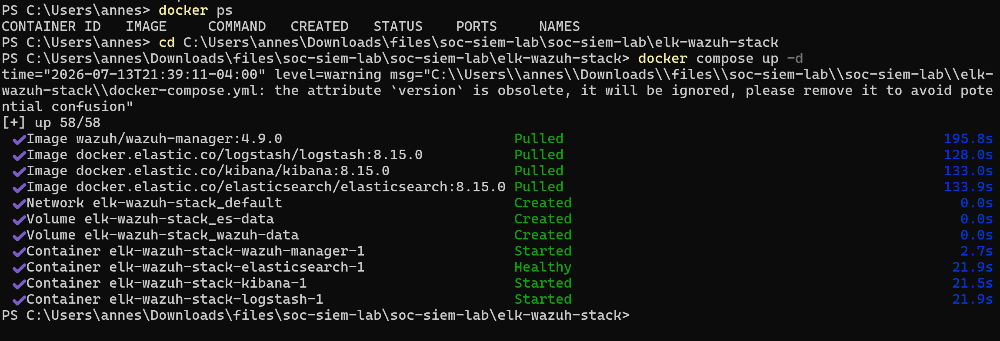
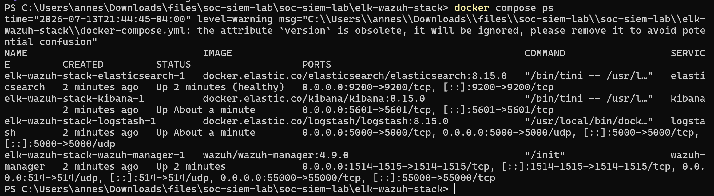
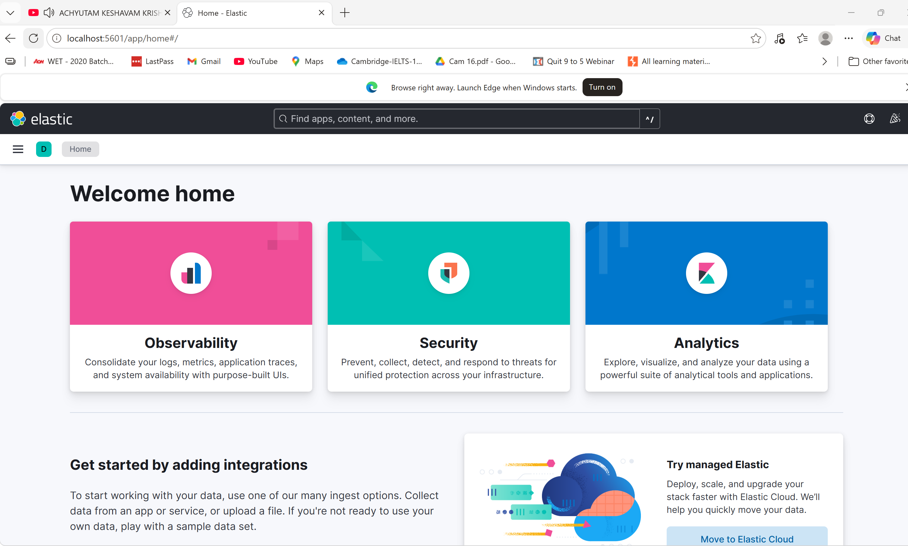
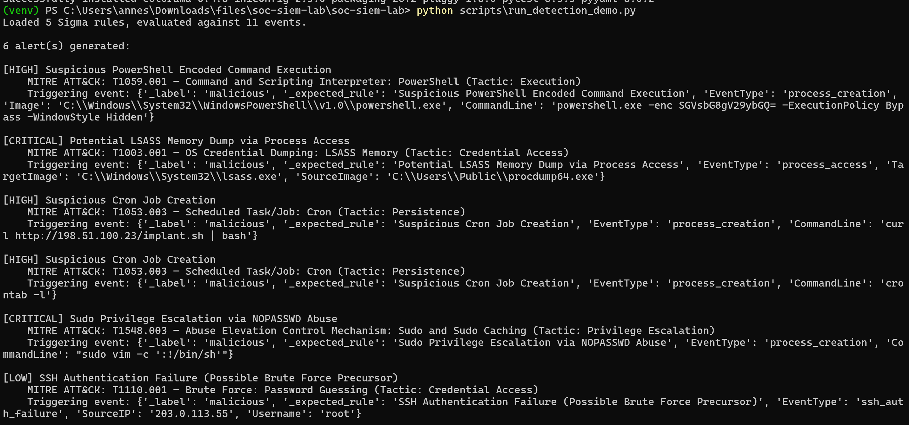
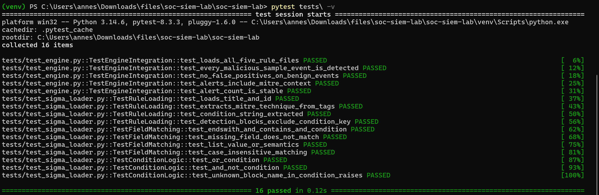

# SOC / SIEM Home Lab — Sigma Detection Rules + MITRE ATT&CK + ELK/Wazuh

A detection engineering lab: real-format Sigma rules mapped to MITRE
ATT&CK techniques, a Python evaluator to test rule logic fast without a
full SIEM running, synthetic attack/benign log events proving detection
coverage, and the actual ELK + Wazuh docker-compose stack to run these
rules against a real SIEM backend.


## Two layers verified

This project splits into a layer tested via pure Python and a layer
requiring real infrastructure — **both are working**:

**Layer 1 — Sigma rule logic (`detection_engine/`)**: a Python
implementation of a real, documented subset of Sigma's detection syntax
(selection blocks, `contains`/`startswith`/`endswith`/`re` modifiers,
`and`/`or`/`not` conditions).

**Layer 2 — the real SIEM stack (`elk-wazuh-stack/`)**: actual
Elasticsearch, Kibana, Logstash, and Wazuh manager containers via Docker
Compose — confirmed running end to end, including Kibana's web UI
actually loading in a browser.

## Why Sigma specifically

[Sigma](https://github.com/SigmaHQ/sigma) is the real, widely-adopted
generic SIEM signature format — rules written once in Sigma compile to
Splunk SPL, Elastic KQL/EQL, Wazuh rules, and others via `pySigma`. Using
real Sigma syntax (not an invented rule format) means these rules are
genuinely portable to a real SIEM, and the skill of writing them
transfers directly.

## Repository layout

```
sigma-rules/           5 real Sigma-format detection rules
detection_engine/
  sigma_loader.py       parses + evaluates Sigma rules (documented subset)
  mitre_mapping.py       MITRE ATT&CK technique reference
  log_simulator.py       synthetic Sysmon/auditd-shaped events
  engine.py               loads all rules, runs detection, adds MITRE context
elk-wazuh-stack/
  docker-compose.yml      real ELK + Wazuh manager stack
  logstash/pipeline/       Logstash config for ingesting events
scripts/
  run_detection_demo.py    runs everything end-to-end, no Docker needed
tests/
  test_sigma_loader.py
  test_engine.py
```

## Try it immediately — no Docker, no SIEM needed

```bash
pip install -r requirements.txt
python scripts/run_detection_demo.py
```

Loads all 5 Sigma rules, runs them against 11 synthetic events (6
malicious, 5 benign), and prints alerts with MITRE ATT&CK context. Every
malicious event is caught by its intended rule; zero false positives on
the benign events.

## The 5 detection rules

| Rule | MITRE Technique | Tactic |
|---|---|---|
| Suspicious PowerShell Encoded Command | T1059.001 | Execution |
| Potential LSASS Memory Dump | T1003.001 | Credential Access |
| Suspicious Cron Job Creation | T1053.003 | Persistence |
| Sudo Privilege Escalation (GTFOBins-style) | T1548.003 | Privilege Escalation |
| SSH Auth Failure (brute-force precursor) | T1110.001 | Credential Access |

## Running the tests

```bash
pytest tests/ -v
```

16 tests: 11 on the Sigma evaluator itself (field matching, all 4
modifiers, AND/OR/NOT condition logic, case-insensitivity, missing-field
handling), 5 integration tests confirming every rule loads, every
malicious sample event is caught, and no benign event triggers a false
alarm.

## Running the real ELK + Wazuh stack

```bash
cd elk-wazuh-stack
docker compose up -d
# Elasticsearch: http://localhost:9200
# Kibana:        http://localhost:5601
# Wazuh manager: ports 1514/1515/55000
```

Confirmed working end to end on Windows 11 with Docker Desktop: all 4
containers start successfully, Elasticsearch reports healthy, and
Kibana's web UI loads correctly in a browser.

```bash
docker compose down
```
Shuts the stack down cleanly — do this when you're done, since the stack
uses real RAM while running.

## Screenshots

### Full ELK + Wazuh stack running

`docker compose up -d` in `elk-wazuh-stack/` — all 4 images pulled
(Wazuh manager, Logstash, Kibana, Elasticsearch) and all 4 containers
started, with Elasticsearch reporting healthy.

### All containers confirmed running

`docker compose ps` — Elasticsearch (healthy), Kibana, Logstash, and
Wazuh manager all "Up," with real port mappings (9200 for Elasticsearch,
5601 for Kibana, 5000 for Logstash, 1514/1515/55000 for Wazuh manager).

### Kibana running live

Kibana's home page loaded at `localhost:5601` — confirms the full stack
is not just running as containers but actually serving a working web UI.

### Detection engine demo (no Docker needed)

`python scripts/run_detection_demo.py` — all 6 synthetic malicious events
correctly detected and tagged with their MITRE ATT&CK technique.

### Test suite

`pytest tests/ -v` — all 16 tests passing.

## Testing status

- ✅ All 16 tests pass. This includes deliberately testing the AND/OR/NOT
  condition logic with cases designed to fail if the logic were subtly
  wrong (e.g. a rule requiring `selection and not filter` correctly
  rejects an event matching `selection` alone when it ALSO matches
  `filter`).
- ✅ **A real bug caught mid-build**: while writing the test suite, I hit
  a genuine failure caused by over-escaping a backslash in a YAML test
  fixture (`'\\\\cmd.exe'` in the Python source produced a literal
  double-backslash in the YAML content, which then failed to match a
  real single-backslash Windows path like `C:\...\cmd.exe`). Debugging
  traced this to the test fixture, not the evaluator — a good reminder
  that YAML single-quoted strings don't process backslash escapes at
  all. Fixed and re-verified.
- ✅ Ran the full demo end-to-end and manually cross-checked that all 6
  malicious synthetic events were caught by name, and all 5 benign events
  produced zero alerts.
- ✅ **The ELK/Wazuh docker-compose stack is fully verified** — ran
  `docker compose up -d` on Windows 11 with Docker Desktop, confirmed all
  4 containers started successfully (Elasticsearch reporting healthy),
  and confirmed Kibana's web UI actually loads and renders correctly at
  `localhost:5601`.

## Known limitations of the Sigma evaluator

- **No aggregation/correlation rules.** Real brute-force detection needs
  "N failures from the same source within T seconds" — this evaluator
  only matches single events. The SSH rule is deliberately left as a
  documented example of a precursor signal, not a complete brute-force
  detector.
- **No `1 of selection*` / `all of them` wildcard block references** —
  a real Sigma feature for referencing multiple similarly-named blocks at
  once, not implemented here.
- For production use, compile these Sigma rules with the real `pySigma`
  library against your actual SIEM backend (Elastic, Splunk, Wazuh) —
  this Python evaluator is for fast local rule-logic testing during
  development, not a SIEM replacement.
- The Docker stack was verified to start and run correctly, but no actual
  log ingestion pipeline (Logstash → Elasticsearch → Kibana dashboard)
  was configured and tested end-to-end — that's the natural next step
  for this project.

## License

MIT — see [LICENSE](./LICENSE).
